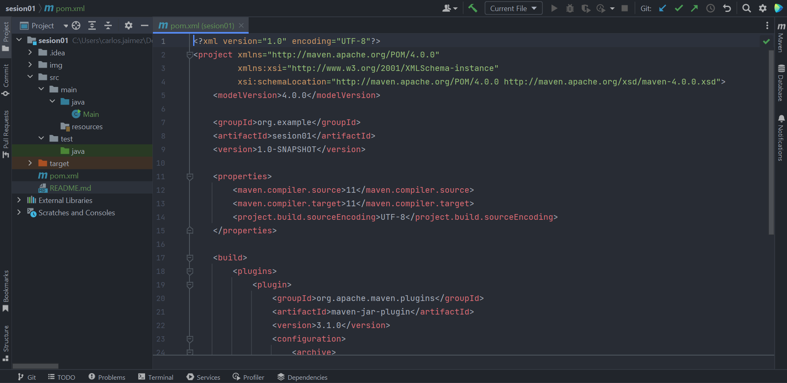
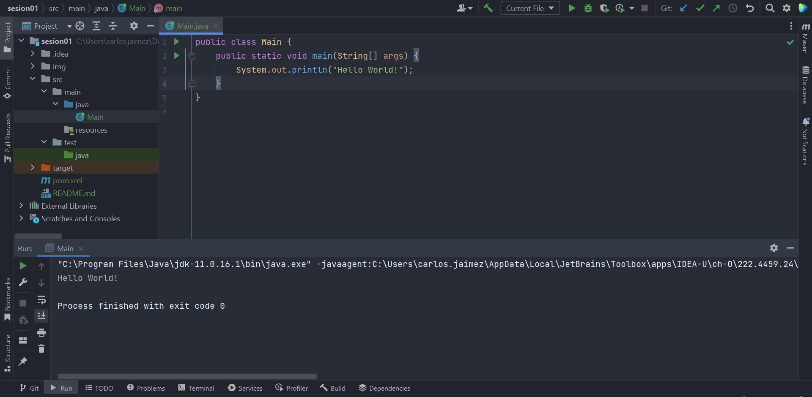
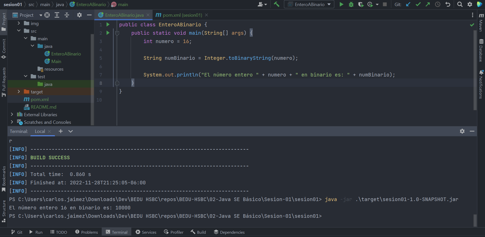
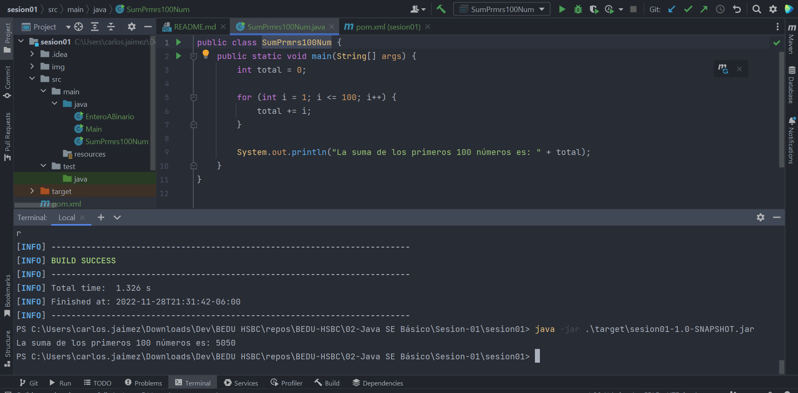

# Sesión 01 ⚙🛠️

Proyecto en Java con build tool Maven.

Contiene:

- Ejemplo 1
- Ejemplo 2
- Ejemplo 3
- Ejemplo 4
- Reto 1
- Reto 2

## Comandos

`mvn package`  

`java -jar .\target\sesion01-1.0-SNAPSHOT.jar`

## Evidencias 🗂️

- Ejemplo 1  

    

- Ejemplo 2  

  `> mvn validate`  

    

  `> mvn compile`  

    

  `> mvn test`  

    

  `> mvn package`  

    

- Ejemplo 3  

    

- Ejemplo 4  

    

- Reto 1  

    

- Reto 2  

    

## Maven Phases

- `validate` - validate the project is correct and all necessary information is available
- `compile` - compile the source code of the project
- `test` - test the compiled source code using a suitable unit testing framework. These tests should not require the code be packaged or deployed
- `package` - take the compiled code and package it in its distributable format, such as a JAR.
- `verify` - run any checks on results of integration tests to ensure quality criteria are met
- `install` - install the package into the local repository, for use as a dependency in other projects locally
- `deploy` - done in the build environment, copies the final package to the remote repository for sharing with other developers and projects.

## Opcionales

- `clean` - si se invoca manualmente, Maven eliminará todos los recursos generados durante la compilación y el empaquetado, borrando el directorio target.
- `site` - produce un informe en HTML acerca del proyecto mostrando la documentación del API de Javadoc y estadísticas según las herramientas de análisis que se hayan configurado.

## Construido con 🛠️

* [Java]() Lenguaje utilizado
* [Maven]() Build Tool
* [IntelliJ IDEA]() IDE utilizado

## Autor ✒️

* **Carlos Jaimez** - *Código inicial* - [carlosjz18](https://github.com/carlosjz18)
