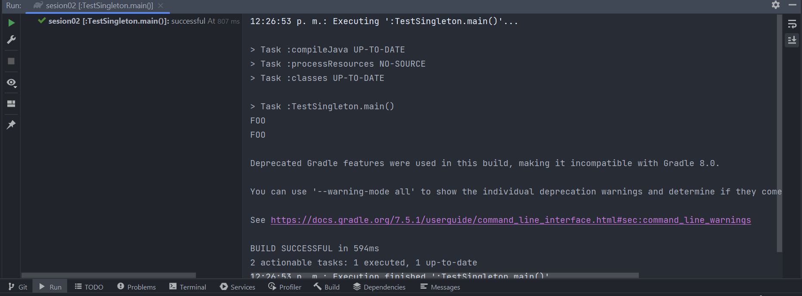
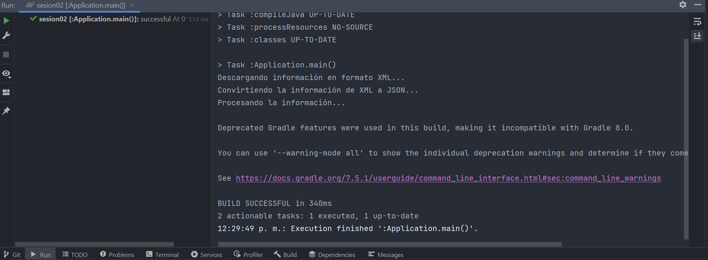
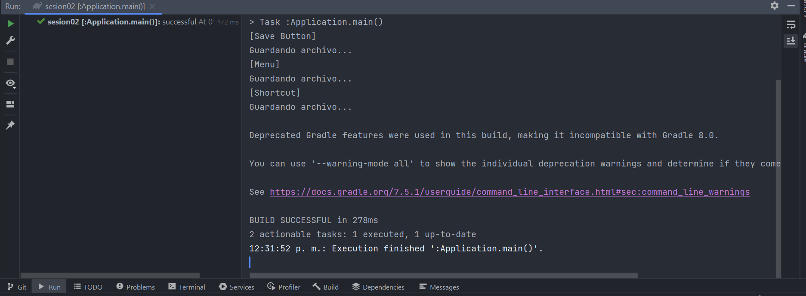
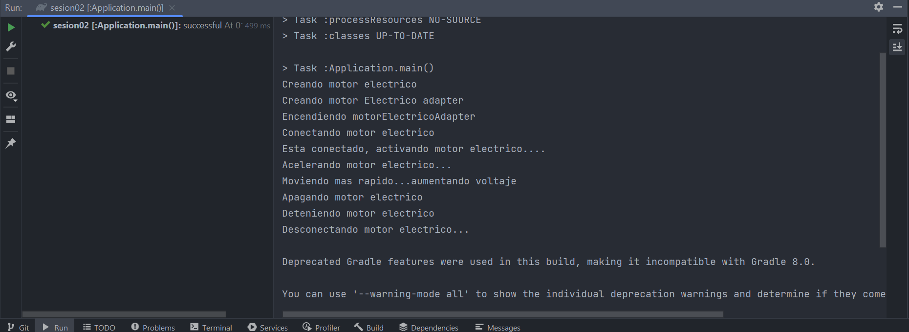
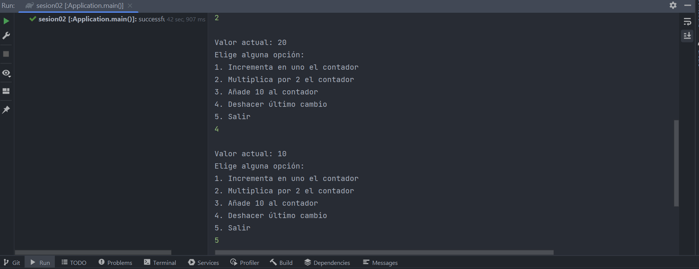
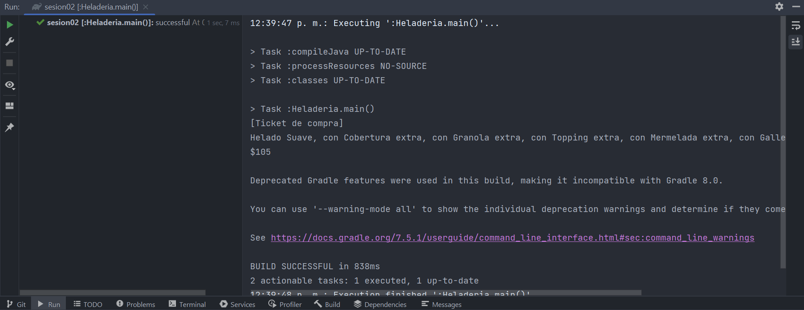
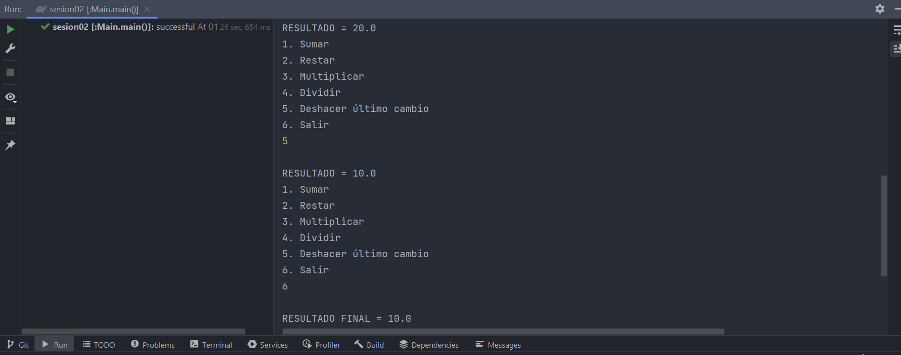
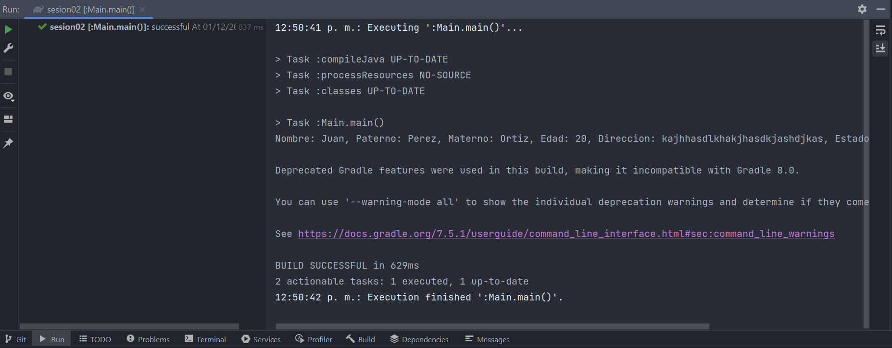

# Sesión 02 ⚙️

BEDU: Developer Engineering
- Modulo 02: Java SE Básico
- Sesion 02: Patrones de diseño

## Contenido

- Ejemplo 01
- Ejemplo 02
- Ejemplo 03
- Reto 01
- Reto 02
- Reto 03: Calculadora
- Postwork: Haladería

## Evidencias 🗂️

- Ejemplo 01: Creacionales - Singleton  

    

- Ejemplo 02: Estructurales - Adapter - StockMarketAdapter/AnalysisLibrary  

    

- Ejemplo 03: Comportamiento - Command - TextEditor/SaveCommand  

    

- Reto 01: Estructurales - Adapter - MotorComun/MotorElectrico  

    

- Reto 02: Comportamiento - Command - Add10Command/IncrementCommand/MultiplyBy2Command  

    

- Postwork: Estructurales - Decorator - Heladería  

    

- Trabajo en sesión:  

  - Comportamiento - Command - Calculadora  

    

  - Creacionales - Builder - Persona  

  

## Commands

### With command `gradle`:

`gradle run`

`gradle build`

`java -jar .\build\libs\sesion02-1.0-SNAPSHOT.jar`

### With command `./gradlew`:

`./gradlew run`

`./gradlew build`

`java -jar .\build\libs\sesion02-1.0-SNAPSHOT.jar`

To run the project with command `./gradlew run` or `gradle run` add the following code to `build.gradle`

```groovy
plugins {
    id 'application'
}
application {
    mainClass = "mx.com.cj.patrones.creacionales.singleton.TestSingleton"
}
```

To execute the jar with `java -jar .\build\libs\sesion02-1.0-SNAPSHOT.jar` add the following code to `build.gradle`

```groovy
jar {
    manifest {
        attributes 'Main-Class': 'mx.com.cj.patrones.creacionales.singleton.TestSingleton'
    }
}
```

## Construido con 🛠️

* [Java 11]() Lenguaje utilizado
* [Gradle]() Tool Build
* [IntelliJ IDEA]() IDE utilizado

## Autor ✒️

* **Carlos Jaimez** - *Código inicial* - [carlosjz18](https://github.com/carlosjz18)